# E2E ENRICHED SPECIFICATION – HỆ THỐNG APAG (HCQTC)

> **Phiên bản:** 1.0 · **Ngày phát hành:** 23/05/2026
> **Mục đích:** Tài liệu kỹ thuật chi tiết (data-rich + diagram-rich) phục vụ viết test plan, sinh test case QA, và làm báo cáo DOCX chuyên nghiệp.
> **Nguồn dữ liệu:** Suy luận 100% từ source code Angular 18 (FE), Spring Boot (BE), và 5 file Playwright spec.

---

## MỤC LỤC

1. [Tổng quan hệ thống](#1-tổng-quan-hệ-thống)
2. [Phân tích kiến trúc và mã nguồn](#2-phân-tích-kiến-trúc-và-mã-nguồn)
3. [Đặc tả chi tiết 3 module](#3-đặc-tả-chi-tiết-3-module)
4. [Phân tích dữ liệu mock](#4-phân-tích-dữ-liệu-mock)
5. [Luồng người dùng end-to-end](#5-luồng-người-dùng-end-to-end)
6. [Sinh kịch bản kiểm thử](#6-sinh-kịch-bản-kiểm-thử)

---

## 1. TỔNG QUAN HỆ THỐNG

### 1.1. Mô tả

APAG là nền tảng web quản lý thi cử của Học viện Cán bộ Quản lý Thành phố (HCQTC). Hệ thống phục vụ toàn bộ quy trình từ lập kế hoạch thi, tổ chức phòng thi, nộp bài trực tuyến, đến chấm điểm ẩn danh theo mã phách.

- **URL production:** `https://hcqtc.vn`
- **Stack:** Angular 18 + PrimeNG (FE) | Spring Boot + JPA + PostgreSQL (BE) | Google Drive (lưu trữ tệp)
- **Test framework:** Playwright 1.x + Chromium

### 1.2. Mục tiêu kiểm thử E2E

Bộ test phủ ba luồng nghiệp vụ cốt lõi:

| # | Chức năng | Vai trò chính | Spec file |
|---|-----------|---------------|-----------|
| 1 | Quản lý Kế hoạch thi | Secretary / Admin | `exam-schedule-management.spec.ts` |
| 2 | Nộp bài tập lớn trực tuyến | Student | `subject-submission.spec.ts` |
| 3 | Chấm điểm thi trực tuyến | Grader | `grader-scoring.spec.ts` |

### 1.3. Đối tượng sử dụng

| Vai trò | Quyền chính | Angular Guard | Dashboard URL |
|---------|-------------|---------------|---------------|
| `ADMIN` / `SECRETARY` | CRUD kế hoạch thi, quản lý phòng, import/export | `SecretaryGuard` | `/dashboard/` |
| `ADMIN_PHACH` | Quản lý mã phách | `AdminPhachGuard` | `/dashboard/exam-room-covers` |
| `ADMIN_CHAM` | Khởi tạo phiên chấm, giao grader, template | `AdminChamGuard` | `/dashboard/exam-room-scoring` |
| `GRADER` | Nhập điểm theo mã phách | `GraderGuard` | `/dashboard-grader/scoring` |
| `STUDENT` | Xem lịch thi, nộp bài, xem điểm | `StudentGuard` | `/dashboard-student/subjects` |

### 1.4. Luồng nghiệp vụ tổng thể

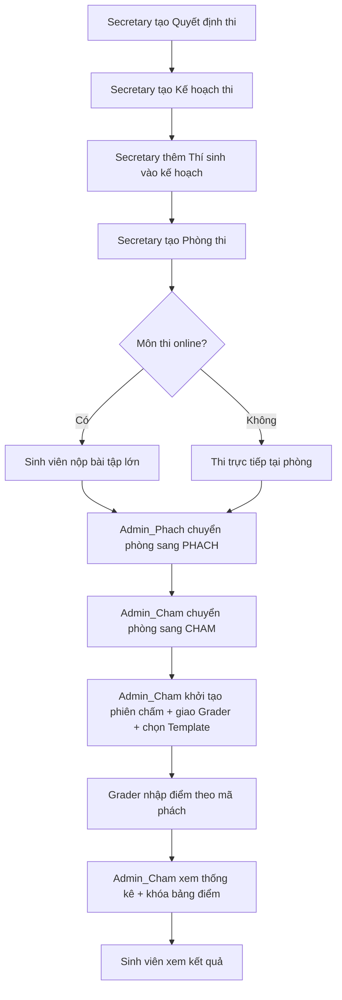

---

## 2. PHÂN TÍCH KIẾN TRÚC VÀ MÃ NGUỒN

### 2.1. Cấu trúc project

```
apag-fe/                                   # Angular 18 Frontend
  src/app/
    components/
      exam-schedule-management/            # Module 1: Quản lý kế hoạch thi
      subject-submission/                  # Module 2: Nộp bài tập lớn
      grader-scoring/                      # Module 3: Chấm điểm
      dashboard-grader/                    # Layout chung cho grader
      dashboard-student/                   # Layout chung cho sinh viên
    services/
      exam-schedule.service.ts             # API kế hoạch thi
      assignment.service.ts                # API nộp bài
      grader-scoring.service.ts            # API chấm điểm
      auth.service.ts                      # Xác thực
    models/
      exam-schedule.model.ts               # Interface ExamSchedule
      grading.model.ts                     # ScoreItem, GraderAssignmentDTO, ...
    guards/                                # Route guards theo vai trò
  e2e/                                     # Playwright test suite
    helpers/                               # Helper dùng chung
    mock-file/                             # PDF/Excel cho test sinh viên
    excel/                                 # Excel import cho grader

apag-be/                                   # Spring Boot Backend
  src/main/java/com/example/news_backend/
    controller/
      ExamScheduleController.java          # REST /api/exam-schedules
      AssignmentSubmissionController.java  # REST /api/assignments/submissions
      GraderScoringController.java         # REST /api/grader
    service/
      ExamScheduleService.java
      AssignmentSubmissionService.java
      CandidateScoreService.java
      GraderService.java
    entity/
      ExamSchedule.java                    # JPA entity
      AssignmentSubmission.java            # JPA entity
      CandidateScore.java                  # JPA entity
```

### 2.2. Sơ đồ phụ thuộc giữa các module

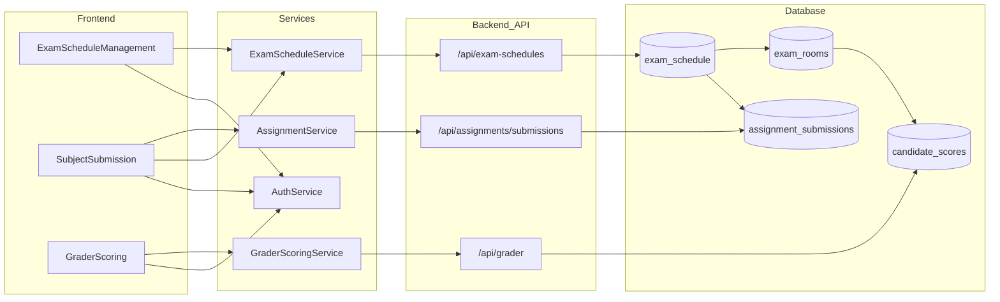

### 2.3. Luồng dữ liệu tổng thể

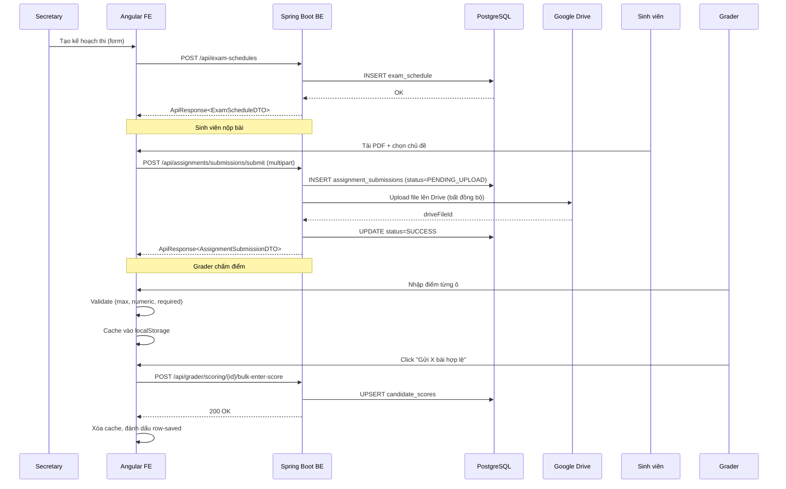

### 2.4. Cấu hình Playwright

| Cấu hình | Giá trị | Ý nghĩa |
|----------|---------|---------|
| `testDir` | `./e2e` | Thư mục chứa spec |
| `globalSetup` | `./e2e/global-setup.ts` | Hàm chạy 1 lần trước toàn bộ test runner |
| `timeout` | `60_000` ms | Mỗi TC tối đa 60 giây |
| `expect.timeout` | `10_000` ms | Mỗi `expect()` chờ tối đa 10 giây |
| `fullyParallel` | `false` | Chạy tuần tự vì cùng database |
| `retries` | `1` | Mỗi TC fail được retry 1 lần |
| `use.baseURL` | `https://hcqtc.vn` | Base URL cho `page.goto()` |
| `use.headless` | `false` | Mở trình duyệt thật để dễ debug |
| `use.viewport` | `1440 × 900` | Đảm bảo layout desktop |
| `use.screenshot` | `only-on-failure` | Chụp ảnh khi TC fail |
| `use.video` | `retain-on-failure` | Quay video TC fail |
| `use.trace` | `retain-on-failure` | Lưu trace để debug |
| `use.locale` | `vi-VN` | Trình duyệt giả lập tiếng Việt |
| `use.timezoneId` | `Asia/Ho_Chi_Minh` | Đảm bảo giờ Việt Nam, tránh sai múi giờ |

### 2.5. Cơ chế chia sẻ trạng thái đăng nhập (storageState)

Hệ thống dùng 3 cách để tránh phải login lại trong từng TC:

**Cách 1 – `globalSetup` (cho `grader-scoring.spec.ts`):**
File `global-setup.ts` chạy đúng 1 lần trước toàn bộ test runner, login `lamtung` rồi lưu cookies + localStorage vào `e2e/.auth/grader.json`. Spec sau đó chỉ cần `test.use({ storageState: AUTH_STATE_FILE })` là đã ở trạng thái đăng nhập.

**Cách 2 – Login trong TC đầu rồi lưu state (cho `exam-schedule-management`, `subject-submission`):**
TC đầu tiên (vd `TC-ESM-00`) gọi `loginAsSecretary(page)` rồi `await page.context().storageState({ path: AUTH_FILE })`. Sub-describe phía sau dùng `test.use({ storageState })` để kế thừa.

**Cách 3 – Login riêng cho từng spec setup:**
Mỗi spec setup có file storage riêng để chạy độc lập, có thể remake bất kỳ lúc nào.

| File storageState | Spec sinh ra | Spec sử dụng | Tài khoản |
|-------------------|--------------|--------------|-----------|
| `e2e/.auth/grader.json` | `global-setup.ts` (auto) | `grader-scoring.spec.ts` | `lamtung` |
| `e2e/secretary-esm-auth.json` | `exam-schedule-management.spec.ts` (TC-ESM-00) | chính nó | `root` |
| `e2e/student-auth.json` | `subject-submission.spec.ts` (TC-SS-01) | chính nó | `CT070218` |
| `e2e/secretary-setup-auth.json` | `setup-grader-mock-data.spec.ts` (SETUP-01) | chính nó (SETUP-02..07) | `root` |
| `e2e/secretary-setup-ss-auth.json` | `setup-subject-submission-data.spec.ts` (SETUP-SS-01) | chính nó | `root` |

---

## 3. ĐẶC TẢ CHI TIẾT 3 MODULE

### 3.1. Module 1 – Quản lý Kế hoạch thi

| Thuộc tính | Giá trị |
|------------|---------|
| **Component** | `ExamScheduleManagementComponent` |
| **Route** | `/dashboard/exam-schedules` |
| **Backend Controller** | `ExamScheduleController` |
| **Backend Service** | `ExamScheduleService` |
| **Entity / Table** | `ExamSchedule` / `exam_schedule` |

#### 3.1.1. Chức năng

- CRUD kế hoạch thi (tạo, sửa, xóa, xem chi tiết)
- Tìm kiếm theo: quyết định thi, tên môn, mã môn, hình thức, trạng thái phòng
- Phân trang + sắp xếp theo cột
- Ẩn/hiện cột tùy chỉnh
- Import Excel hàng loạt
- Export Excel từng kế hoạch
- Đồng bộ bản mã (sync hash)
- Đếm ngược thời gian bắt đầu thi

#### 3.1.2. Form Fields & Validators

| `formControlName` | Bắt buộc | Validator | Loại UI | Ghi chú |
|-------------------|----------|-----------|---------|---------|
| `subjectName` | Có | `Validators.required` | text input | Tên môn học |
| `subjectCode` | Có (chỉ ở edit) | `Validators.required` (set lại khi mở edit) | text input | Disabled khi tạo mới |
| `clazz` | Có | `Validators.required` | text input | Lớp học phần |
| `subjectCodeUnique` | Không | – | text input | Mã unique |
| `subjectCredits` | Không | – | text input | Số tín chỉ |
| `format` | Không | – | text input | Tự luận / Trắc nghiệm |
| `onlineExam` | Không | – | text input | "x" nếu thi online |
| `startTimeRaw` | Có | `required` + `pattern(/\d{1,2}\/\d{1,2}\/\d{4}\s+\d{2}:\d{2}/)` | text input linh hoạt | Xem 3.1.3 |
| `releaseTimeRaw` | Không | – | text input | Thời gian công bố điểm |
| `initTime` | Không (auto) | – | p-calendar (ẩn) | Tự sinh từ `startTimeRaw` |
| `stopTime` | Không (auto) | – | p-calendar | `[minDate]="minStopDate"` |
| `note` | Không | – | textarea | Ghi chú |

#### 3.1.3. Business Rules – `startTimeRaw`

Logic xử lý trong `onStartTimeBlur()`:

**Regex pattern:**
```
(?:từ\s+)?(?:ngày\s+)?(\d{1,2}\/\d{1,2}(?:\/\d{2,4})?)(?:\s+(\d{1,2}:\d{2}))?
.*?(?:đến|->|—|-|to)\s+
(?:ngày\s+)?(\d{1,2}\/\d{1,2}(?:\/\d{2,4})?)(?:\s+(\d{1,2}:\d{2}))?
```

**Quy tắc auto-fill:**
- Thiếu giờ → mặc định **`07:00`**
- Thiếu năm → dùng `new Date().getFullYear()`
- Single date → `stopTime = ngày đó 23:59`
- `date2 <= date1` → `setErrors({invalidRange: true})`, submit disabled

**Bảng ví dụ Input/Output:**

| Input người dùng | Output sau blur | initTime | stopTime | Kết quả |
|------------------|-----------------|----------|----------|---------|
| `01/12/2025 08:00 đến 01/12/2026 10:00` | `Từ ngày 01/12/2025 08:00 đến 01/12/2026 10:00` | 01/12/2025 08:00 | 01/12/2026 10:00 | OK |
| `Từ ngày 13/05/2026 tới ngày 25/12/2027` | `Từ ngày 13/05/2026 07:00 đến 25/12/2027 07:00` | 13/05/2026 07:00 | 25/12/2027 07:00 | OK, auto giờ 07:00 |
| `14/05 00:00 -> 15/05 23:59` | `Từ ngày 14/05/{year} 00:00 đến 15/05/{year} 23:59` | 14/05/now 00:00 | 15/05/now 23:59 | OK, auto năm |
| `01/12/2025` (single date) | `Ngày 01/12/2025 07:00` | 01/12/2025 07:00 | 01/12/2025 23:59 | OK |
| `ngày 01 tháng 12 năm 2025` | KHÔNG match | – | – | LỖI: `.f-err` "dd/mm/yyyy HH:mm" |
| `25/12/2026 10:00 đến 01/01/2026 08:00` | Match nhưng end ≤ start | – | – | LỖI: "Ngày kết thúc phải sau ngày bắt đầu" |

#### 3.1.4. Validation `endDate < startDate` – hai lớp bảo vệ

**Lớp 1 – Khi nhập text vào `startTimeRaw`:**

```typescript
if (date2 <= date1) {
  this.form.get('startTimeRaw')?.setErrors({ invalidRange: true });
  this.form.get('startTimeRaw')?.markAsTouched();
  return;
}
```

→ `.f-err` hiển thị thông báo, button submit bị disabled.

**Lớp 2 – Khi dùng datepicker chọn `stopTime`:**

```typescript
this.form.get('initTime')?.valueChanges.subscribe((val: Date | null) => {
  this.minStopDate = val instanceof Date && !isNaN(val.getTime())
    ? val
    : new Date(0);
  if (currentStop < val) this.form.patchValue({ stopTime: null });
});
```

Template: `<p-calendar formControlName="stopTime" [minDate]="minStopDate">`

→ Trong UI, các ngày trước `initTime` bị **grayed-out, không click được**. Đây chính là cơ chế "disable không cho bấm chọn ở datepicker" mà yêu cầu nghiệp vụ đặt ra.

#### 3.1.5. Workflow tạo kế hoạch thi

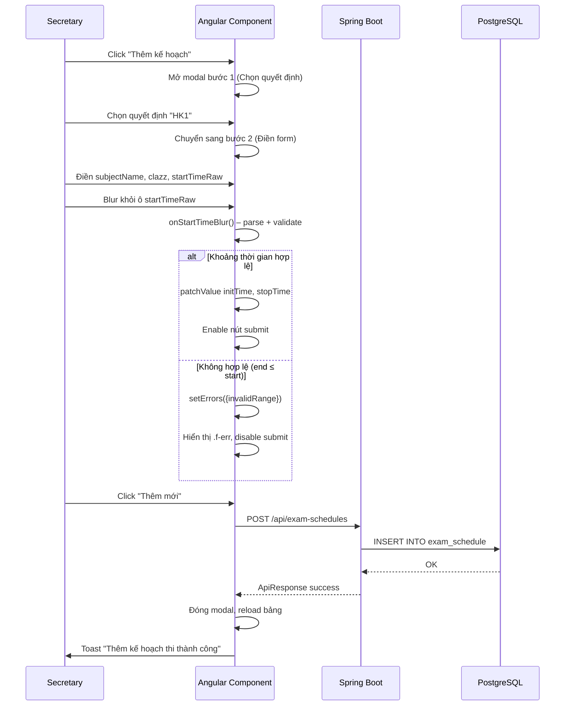

#### 3.1.6. API Endpoints

| Method | Path | Auth | Mô tả |
|--------|------|------|-------|
| POST | `/api/exam-schedules` | ADMIN, SECRETARY | Tạo mới kế hoạch |
| PUT | `/api/exam-schedules/{id}` | ADMIN, SECRETARY | Cập nhật |
| DELETE | `/api/exam-schedules/{id}` | ADMIN, SECRETARY | Xóa |
| GET | `/api/exam-schedules/search` | Authenticated | Tìm kiếm phân trang |
| POST | `/api/exam-schedules/bulk-import` | ADMIN, SECRETARY | Import từ JSON |
| GET | `/api/exam-schedules/online-by-student` | STUDENT | Lấy môn thi online của SV |

#### 3.1.7. Entity `ExamSchedule` (JPA)

| Column | Type | Nullable | Ghi chú |
|--------|------|----------|---------|
| `id` | Long (PK) | NO | Auto-gen |
| `subject_name` | String | NO | Tên môn |
| `subject_code` | String | NO | Mã môn |
| `subject_code_unique` | String | NO | Mã unique |
| `class_name` | String | YES | Lớp học phần |
| `format` | String | YES | Hình thức thi |
| `online_exam` | String | YES | "x" nếu online |
| `start_time_raw` | String | YES | Chuỗi thời gian gốc |
| `init_time` | LocalDateTime | YES | Thời điểm bắt đầu |
| `stop_time` | LocalDateTime | YES | Thời điểm kết thúc |
| `exam_decision_id` | FK | YES | Liên kết quyết định thi |
| `note` | String | YES | Ghi chú |

**Quan hệ:** ExamSchedule (1) — (N) ExamRoom, (N) Candidate, (N) AssignmentSubmission.

#### 3.1.8. Edge cases đã được code xử lý

- Auto chuẩn hóa nhiều format thời gian: `đến`, `->`, `tới`, `to`, `—`, `-`
- Thiếu năm → dùng năm hiện tại
- Thiếu giờ → mặc định 07:00
- Năm 2 chữ số (vd `25` → `2025`)
- `single date` → `stopTime` mặc định 23:59 cùng ngày
- Khi sửa `initTime`, nếu `stopTime` đang nhỏ hơn → tự reset `stopTime`

---

### 3.2. Module 2 – Nộp bài tập lớn của sinh viên

| Thuộc tính | Giá trị |
|------------|---------|
| **Component** | `SubjectSubmissionComponent` |
| **Route** | `/dashboard-student/subjects` (danh sách), `/dashboard-student/history` (lịch sử) |
| **Backend Controller** | `AssignmentSubmissionController` |
| **Backend Service** | `AssignmentSubmissionService` |
| **Entity / Table** | `AssignmentSubmission` / `assignment_submissions` |
| **File storage** | Google Drive |

#### 3.2.1. Chức năng

- Hiển thị danh sách môn thi online được phân công cho sinh viên
- Đếm ngược thời gian bắt đầu / kết thúc nộp bài
- Nộp file PDF (tối đa 20 MB) kèm chủ đề và mô tả
- Xem chi tiết môn thi
- Xem lịch sử nộp bài + xóa bài đã nộp
- Liên hệ hỗ trợ

#### 3.2.2. Điều kiện hiển thị môn thi cho sinh viên

Sinh viên chỉ thấy môn thi khi:
1. Môn có `onlineExam = "x"` (thi online).
2. Sinh viên đã được thêm vào kế hoạch thi (có bản ghi `Candidate`).
3. Thời gian hiện tại nằm trong khoảng `[initTime, stopTime]` để có thể nộp.

API: `GET /api/exam-schedules/online-by-student` – lọc theo `studentCode` lấy từ token đăng nhập.

#### 3.2.3. Form Validation nộp bài

| Field | Bắt buộc | Rule | Error UI |
|-------|----------|------|----------|
| `assignmentName` | Có (readonly) | Tự fill từ `subjectCode-subjectName` | – |
| `topic` | Có | `Validators.required`, phải chọn 1 trong 10 chủ đề | Toast warn + `.ss-error-text` |
| `description` | Không | – | – |
| `file` | Có | type = `application/pdf` AND size ≤ 20 MB | Toast warn |

**Topic options (cố định 10):** `"Chủ đề 1"`, `"Chủ đề 2"`, ..., `"Chủ đề 10"`.

#### 3.2.4. Logic validate file (trích từ source code)

```typescript
private validateFile(file: File): boolean {
  const maxSizeMB = 20;
  const maxSizeBytes = maxSizeMB * 1024 * 1024; // 20,971,520 bytes
  if (file.size > maxSizeBytes) {
    this.addToast('warn', 'Tệp quá lớn',
      `Dung lượng tối đa cho phép là ${maxSizeMB}MB.`);
    return false;
  }
  const allowedMimeTypes = ['application/pdf'];
  const allowedExtensions = ['.pdf'];
  if (!allowedMimeTypes.includes(file.type) && !hasValidExtension) {
    this.addToast('warn', 'Định dạng không hỗ trợ',
      'Chỉ chấp nhận file PDF (.pdf).');
    return false;
  }
  return true;
}
```

#### 3.2.5. Logic Submission Window

```typescript
canSubmit(item: ExamSchedule): boolean {
  if (!this.hasOnlineSubmission(item.onlineExam)) return false;
  return this.isWithinSubmitWindow(item);
}

private isWithinSubmitWindow(item: ExamSchedule): boolean {
  const now = Date.now();
  return now >= initTime && now <= stopTime;
}
```

Các trạng thái UI:
- `now < initTime` → Pill `"Chưa đến giờ"` (ss-pill--waiting), nút disabled.
- `initTime ≤ now ≤ stopTime` → Pill `"Đang mở"` (ss-pill--open), cho phép nộp.
- `now > stopTime` → Pill `"Đã kết thúc"` (ss-pill--ended), nút disabled.

#### 3.2.6. Luồng nộp bài (Flowchart)

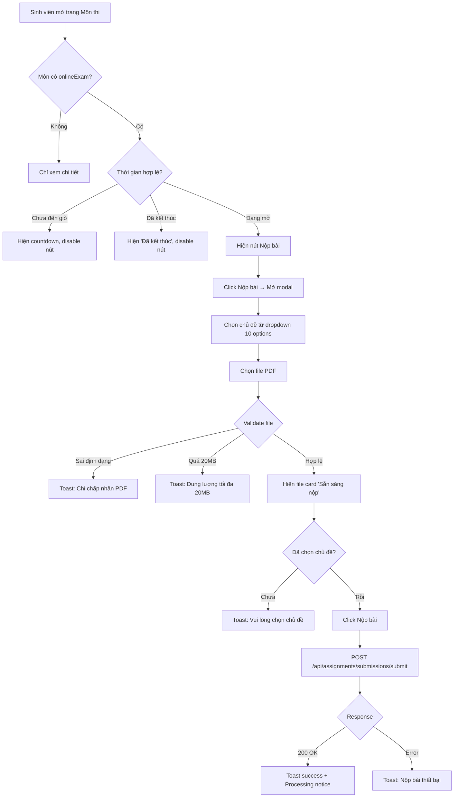

#### 3.2.7. Sequence Diagram nộp bài

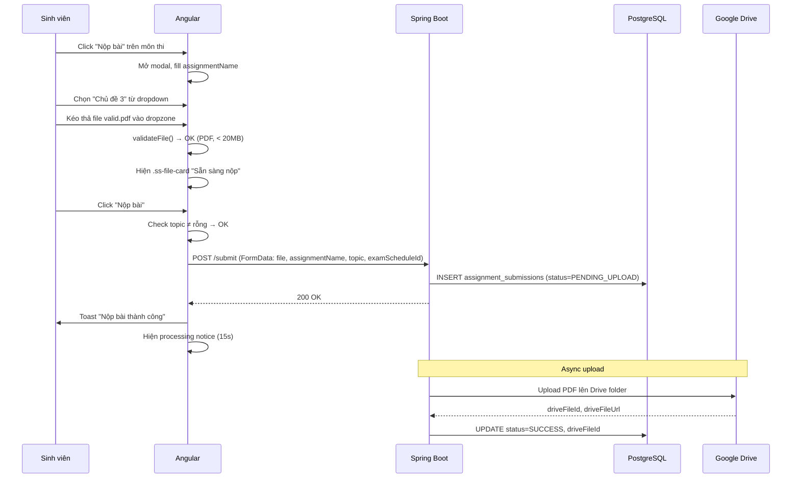

#### 3.2.8. Entity `AssignmentSubmission`

| Column | Type | Ghi chú |
|--------|------|---------|
| `id` | Long (PK) | Auto-gen |
| `assignment_name` | String(200) | Tên bài tập (vd `KTPM2025-Kiểm thử phần mềm`) |
| `student_code` | String(20) | Mã sinh viên |
| `topic` | String(100) | Chủ đề đã chọn |
| `description` | TEXT | Mô tả |
| `drive_file_id` | String(128) | ID file trên Google Drive |
| `drive_file_name` | String(255) | Tên file gốc |
| `mime_type` | String(100) | `application/pdf` |
| `file_size_bytes` | Long | Dung lượng |
| `submitted_at` | LocalDateTime | Thời điểm nộp |
| `processing_status` | Enum | `PENDING_UPLOAD`, `UPLOADING`, `SUCCESS`, `FAILED` |
| `temp_path` | String(500) | Đường dẫn file tạm |
| `exam_schedule_id` | FK | Liên kết kế hoạch thi |
| `status` | Enum | `SUBMITTED`, `RESUBMITTED` |

#### 3.2.9. Error handling

| Trường hợp | Hành vi |
|------------|---------|
| Mất kết nối khi upload | Toast "Không thể nộp bài. Vui lòng thử lại." |
| File 0 byte | Vẫn pass validate (chưa check) – chỉ chặn ở size > 20MB |
| Tên file dài > 255 ký tự | BE truncate hoặc reject (theo column constraint) |
| Nộp ngoài thời gian | Nút "Nộp bài" bị thay bằng `.ss-act-btn--locked`, click không làm gì |
| Đã nộp trước đó (`isSubmitted = true`) | Toast info "Hệ thống đã ghi nhận bài làm…" – không cho nộp lại trực tiếp |

---

### 3.3. Module 3 – Chấm điểm thi trực tuyến

| Thuộc tính | Giá trị |
|------------|---------|
| **Component** | `GraderScoringComponent` |
| **Route** | `/dashboard-grader/scoring` |
| **Backend Controller** | `GraderScoringController` |
| **Backend Service** | `CandidateScoreService` |
| **Entity / Table** | `CandidateScore` / `candidate_scores` |
| **Hệ đào tạo** | `DH` (Đại học) / `THS` (Thạc sĩ) – switch trên UI |

#### 3.3.1. Chức năng

- Hiển thị danh sách phân công của grader, có phân trang
- Switch hệ đào tạo: Đại học / Thạc sĩ
- Lọc theo trạng thái: Tất cả / Chưa xong / Xong
- Bảng chấm điểm với cột động từ scoring template
- Nhập điểm inline, validate real-time
- Lưu từng bài hoặc lưu hàng loạt (bulk save)
- Cache draft vào localStorage (phòng mất dữ liệu)
- Import điểm từ Excel
- Tải file mẫu Excel
- Xuất bảng điểm ra Excel
- Xem lịch sử chấm điểm theo mã phách
- Cảnh báo `beforeunload` khi có dữ liệu chưa lưu
- Trạng thái khóa (readonly) khi `assignment.isLocked = true`

#### 3.3.2. Cấu trúc bảng chấm điểm

Bảng được render động dựa trên `scoreStructure` (JSON từ `ScoringTemplate`):

```
| # | Mã phách | [Câu 1 /max1] | [Câu 2 /max2] | ... | [Câu N /maxN] | Tổng | Trạng thái | Ghi chú | Lưu |
```

Với template "Viết 3 câu" (Tự luận 3-4-3):

| Cột | Max điểm |
|-----|----------|
| Câu 1 | 3 |
| Câu 2 | 4 |
| Câu 3 | 3 |
| **Tổng** | **10** |

#### 3.3.3. Validation từng ô điểm (trích từ source code)

```typescript
onScoreInput(row: TableRow, colIdx: number, event: Event): void {
  const rawVal = input.value;
  if (rawVal === '' || rawVal.trim() === '') {
    row.scores[colIdx] = null;
    row.errors[colIdx] = null;
  } else {
    const val = parseFloat(rawVal);
    const max = this.scoreStructure[colIdx]?.maxScore ?? Infinity;
    if (isNaN(val) || val < 0) {
      row.errors[colIdx] = 'Không hợp lệ';
    } else if (val > max) {
      row.errors[colIdx] = `Tối đa ${max}`;
    } else {
      row.errors[colIdx] = null;
      row.scores[colIdx] = val;
    }
  }
  this.validateRowCompleteness(row);
}
```

**Bảng tổng hợp validation:**

| Trường hợp | Error message | CSS class | Hệ quả |
|------------|---------------|-----------|--------|
| Trống (sau blur) | `"Bắt buộc nhập"` | `.gs-inp-cell.has-error` | `.gs-error-chip` hiện, submit disabled |
| Ký tự không phải số (`abc`) | `"Không hợp lệ"` | `.gs-inp-cell.has-error` | như trên |
| Số âm (`-1`) | `"Không hợp lệ"` | `.gs-inp-cell.has-error` | như trên |
| Vượt max (vd `10` ở cột max=3) | `"Tối đa 3"` | `.gs-inp-cell.has-error` | như trên |
| Hợp lệ chưa lưu | – | `.row-dirty` | `.gs-draft-banner` hiện |
| Đã lưu | – | `.row-saved` | `.gs-status-icon--ok` |

#### 3.3.4. Logic tính tổng điểm

```typescript
private calcTotal(scores: (number | null)[]): number {
  const sum = scores.reduce((acc, v) => (acc ?? 0) + (v ?? 0), 0);
  return Math.round(sum * 100) / 100; // Làm tròn 2 chữ số thập phân
}
```

#### 3.3.5. LocalStorage Cache (Draft persistence)

```typescript
const CACHE_KEY = (scoringId: number) => `gs_draft_${scoringId}`;

// Lưu khi có thay đổi (chỉ lưu rows dirty)
private persistCache(): void {
  const dirty = this.tableRows.filter(r => r.dirty);
  localStorage.setItem(CACHE_KEY(id), JSON.stringify(dirty.map(r => ({
    coverCode: r.coverCode, scores: r.scores, note: r.note
  }))));
}

// Load khi chọn assignment
private loadCache(scoringId: number): any[] | null {
  const raw = localStorage.getItem(CACHE_KEY(scoringId));
  return raw ? JSON.parse(raw) : null;
}

// Xóa sau khi save thành công
private clearCache(scoringId: number): void {
  localStorage.removeItem(CACHE_KEY(scoringId));
}
```

→ Khi grader F5 hoặc đóng tab giữa chừng, mở lại sẽ thấy điểm đã nhập.

#### 3.3.6. Import Excel – Logic parse

File Excel phải có:
- Cột **"Mã phách"** (bắt buộc).
- Các cột điểm theo tên câu (vd `"Câu 1 (Max: 3)"`).
- Cột **"Tổng cộng"** (optional).
- Cột **"Ghi chú"** (optional).

Quy trình parse:

1. Tìm header row chứa `"Mã phách"` (scan 10 dòng đầu).
2. Xác định các cột điểm giữa `"Mã phách"` và `"Tổng cộng"`.
3. Đọc từng dòng, validate: `isNaN` → lỗi, `> maxScore` → lỗi.
4. Trả về `ParsedRow[]` với flag `valid` / `invalid`.

Nếu có ≥ 1 hàng lỗi → nút "Nhập" bị disabled hoặc không xuất hiện.

#### 3.3.7. Luồng chấm điểm

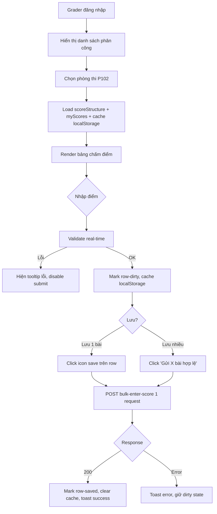

#### 3.3.8. Sequence Diagram chấm điểm

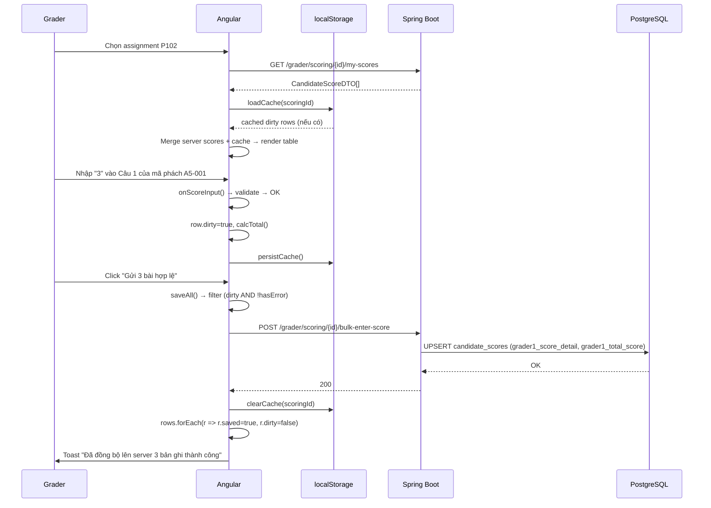

#### 3.3.9. Entity `CandidateScore`

| Column | Type | Ghi chú |
|--------|------|---------|
| `id` | Long (PK) | Auto-gen |
| `exam_room_scoring_id` | FK | Liên kết phiên chấm |
| `cover_code` | String | **Mã phách (ẩn danh, KHÔNG lưu thông tin sinh viên)** |
| `grader1_score_detail` | TEXT (JSON) | `[{"name":"Câu 1","score":3},...]` |
| `grader1_total_score` | Double | Tổng điểm CB1 |
| `grader2_score_detail` | TEXT (JSON) | Tương tự cho CB2 |
| `grader2_total_score` | Double | Tổng điểm CB2 |
| `final_score` | Double | Điểm tổng kết (TB hoặc theo quy định) |
| `note` | TEXT | Ghi chú |

→ Đây là cốt lõi của chấm ẩn danh: chỉ lưu `cover_code`, không lưu studentCode.

#### 3.3.10. Scoring Template Types (Enum)

| Type | Mô tả |
|------|-------|
| `VIET_2_CAU` | Tự luận 2 câu |
| `VIET_3_CAU` | Tự luận 3 câu (dùng trong test: 3-4-3) |
| `VIET_4_CAU` | Tự luận 4 câu |
| `VIET_5_CAU` | Tự luận 5 câu |
| `TIEU_LUAN` | Tiểu luận |
| `BAI_TAP_LON` | Bài tập lớn |
| `TIENG_ANH` | Tiếng Anh |
| `VAN_DAP` | Vấn đáp |
| `CUSTOM` | Tùy chỉnh |

#### 3.3.11. Trạng thái phòng thi (Room Status Flow)

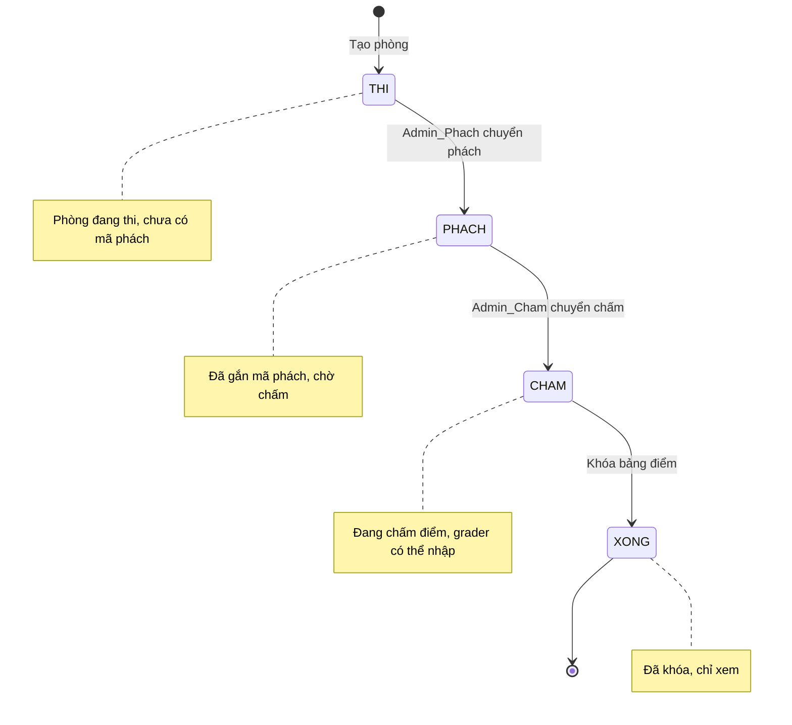

#### 3.3.12. API Endpoints (Grader)

| Method | Path | Mô tả |
|--------|------|-------|
| POST | `/api/grader/scoring/{scoringId}/enter-score` | Nhập điểm 1 mã phách |
| POST | `/api/grader/scoring/{scoringId}/bulk-enter-score` | Nhập điểm hàng loạt |
| GET | `/api/grader/scoring/{scoringId}/my-scores` | Lấy điểm của grader |
| GET | `/api/grader/scoring/{scoringId}/score/{coverCode}` | Lấy điểm theo mã phách |
| GET | `/api/grader/scoring/{scoringId}/export-my-scores` | Xuất Excel |
| GET | `/api/grader/my-assignments` | Danh sách phân công |

#### 3.3.13. Exception handling

| Tình huống | Xử lý |
|------------|-------|
| API trả 400 "Phòng thi chưa sẵn sàng" | Toast error, deselect assignment |
| Token hết hạn | Redirect về `/login` (qua AuthGuard) |
| Mất kết nối khi save | Giữ row-dirty + toast error, dữ liệu vẫn ở localStorage |
| Phòng bị khóa giữa chừng | `assignment.isLocked = true` → set `readonly`, hiện banner "Bảng điểm đã khóa" |
| Beforeunload | Nếu `hasDirty = true` → trình duyệt hiện confirm (headless có thể không trigger) |

---

## 4. PHÂN TÍCH DỮ LIỆU MOCK

### 4.1. File `setup-subject-submission-data.spec.ts`

**Mục đích:** tạo dữ liệu để sinh viên `CT070218` có môn thi online để nộp bài.

| Bước | Hành động | Dữ liệu |
|------|-----------|---------|
| **SETUP-SS-01** | Login Secretary (`root`) | Lưu `secretary-setup-ss-auth.json` |
| **SETUP-SS-02** | Tạo kế hoạch thi online | `subjectName: "Bài tập lớn Kiểm thử PM"`, `clazz: "CT07"`, `code: "BTLKTPM2025"`, `format: "Bài tập lớn"`, `onlineExam: "x"`, `time: 01/06/2026 08:00 → 30/06/2026 23:59` |
| **SETUP-SS-03** | Thêm thí sinh `CT070218` | `studentCode: "CT070218"`, `fullName: "Huỳnh Ngọc Hải"`, `dob: "24/11/2004"`, `clazz: "CT07"` |

### 4.2. File `setup-grader-mock-data.spec.ts`

**Mục đích:** dựng toàn bộ dữ liệu cần thiết để grader `lamtung` có thể chấm điểm.

| Bước | Hành động | Tài khoản | Dữ liệu |
|------|-----------|-----------|---------|
| **SETUP-01** | Login Secretary | `root` | Lưu `secretary-setup-auth.json` |
| **SETUP-02** | Tạo kế hoạch thi | `root` | "Kiểm thử phần mềm", `KTPM2025`, Tự luận, online, `15/12/2025 → 15/12/2026` |
| **SETUP-03** | Tạo phòng thi | `root` | `P102`, mã phách `A5` |
| **SETUP-04** | Thêm thí sinh chính | `root` | `CT070218 – Huỳnh Ngọc Hải` |
| **SETUP-05** | Thêm 10 SV mock | `root` | `CT070201..CT070210` (loop) |
| **SETUP-06** | Chuyển phòng → PHACH | `root` | Click "Chuyển phách" + confirm |
| **SETUP-07** | Chuyển phòng → CHAM | `root` | Edit `status = CHAM` |
| **SETUP-08** | Khởi tạo phiên chấm | **`ADMIN_CHAM`** | Template "Viết 3 câu", CB1 = `lamtung`, CB2 = `huytq` |
| **CLEANUP** | Xóa kế hoạch thi | `root` | Cascade delete phòng + SV + phiên chấm |

> **Thời gian chạy ước tính:** ~5–8 phút do mọi thao tác đều qua UI thật và có nhiều `waitForTimeout` để chờ Angular render + API response.

### 4.3. ERD – Mapping mock data ↔ module

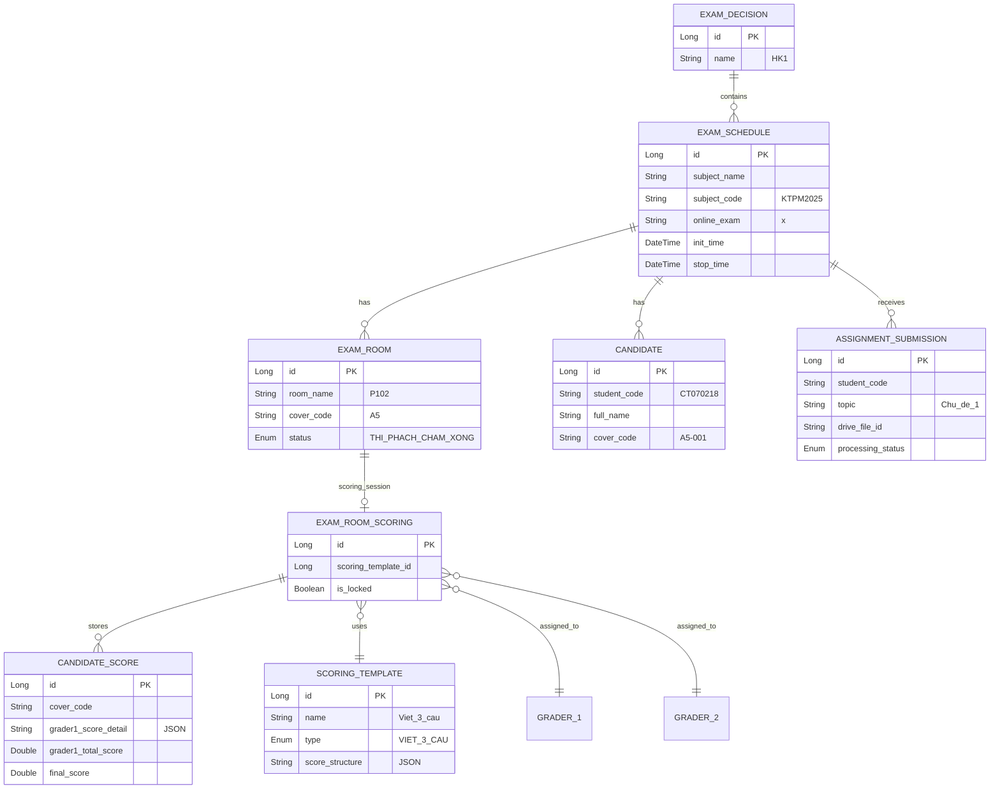

### 4.4. Danh sách 11 thí sinh trong P102

| STT | Mã SV | Họ tên | Ngày sinh | Lớp |
|-----|-------|--------|-----------|-----|
| 1 | CT070218 | Huỳnh Ngọc Hải | 24/11/2004 | CT07 |
| 2 | CT070201 | Nguyễn Văn An | 01/03/2004 | CT07 |
| 3 | CT070202 | Trần Thị Bình | 15/05/2004 | CT07 |
| 4 | CT070203 | Lê Hoàng Cường | 22/07/2004 | CT07 |
| 5 | CT070204 | Phạm Thị Dung | 08/09/2004 | CT07 |
| 6 | CT070205 | Hoàng Văn Em | 30/01/2004 | CT07 |
| 7 | CT070206 | Vũ Thị Phương | 12/04/2004 | CT07 |
| 8 | CT070207 | Đặng Minh Quân | 25/06/2004 | CT07 |
| 9 | CT070208 | Bùi Thị Hoa | 03/08/2004 | CT07 |
| 10 | CT070209 | Ngô Văn Khoa | 17/10/2004 | CT07 |
| 11 | CT070210 | Đinh Thị Lan | 29/12/2004 | CT07 |

### 4.5. Tài khoản test

| Username | Password | Vai trò | Spec sử dụng |
|----------|----------|---------|--------------|
| `root` | `Haibeo2004@` | Secretary / Admin | `exam-schedule-management`, cả 2 file setup |
| `ADMIN_CHAM` | `CHAM@123` | Admin chấm | `setup-grader-mock-data` (SETUP-08) |
| `CT070218` | `Haibeo2004@` | Student – Huỳnh Ngọc Hải, sinh `24/11/2004` | `subject-submission` |
| `lamtung` | `LAM@123` | Grader CB1 | `grader-scoring`, `global-setup` |
| `huytq` | – | Grader CB2 | Chỉ là username trong setup |

### 4.6. Dữ liệu cố định trên server (KHÔNG do test tạo)

| Trường | Giá trị | Yêu cầu |
|--------|---------|---------|
| Quyết định thi | `HK1` | Phải có sẵn |
| Template chấm | `Viết 3 câu` (Tự luận 3-4-3, max 10đ) | Phải có sẵn |

### 4.7. File upload phục vụ kiểm thử

| File | Thư mục | Định dạng | Kích thước | TC sử dụng | Mục đích |
|------|---------|-----------|------------|------------|----------|
| `valid.pdf` | `e2e/mock-file/` | PDF | < 20 MB | TC-SS-08, 09, 10, 11 | Happy path nộp bài |
| `greater-20-mb.pdf` | `e2e/mock-file/` | PDF | > 20 MB | TC-SS-07 | Boundary size – test reject |
| `change.pdf` | `e2e/mock-file/` | PDF | < 20 MB | TC-SS-09 | Thay đổi tệp đã chọn |
| `Invalid.xlsx` | `e2e/mock-file/` | Excel | bất kỳ | TC-SS-06 | Sai định dạng – test reject |
| `VALID.xlsx` | `e2e/excel/` | Excel | – | TC-GS-13 | Import điểm OK |
| `INVALID.xlsx` | `e2e/excel/` | Excel | – | TC-GS-12 | Import điểm sai → báo lỗi |

---

## 5. LUỒNG NGƯỜI DÙNG END-TO-END

### 5.1. Flowchart E2E tổng thể (5 phase)

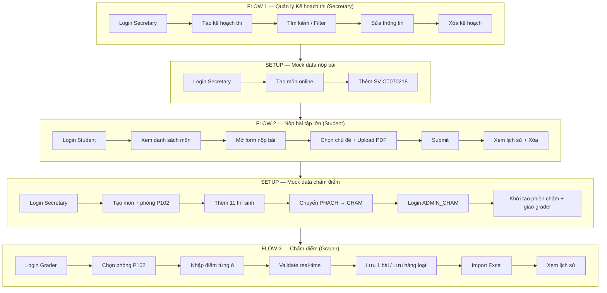

### 5.2. Sequence Diagram tương tác giữa 5 vai trò

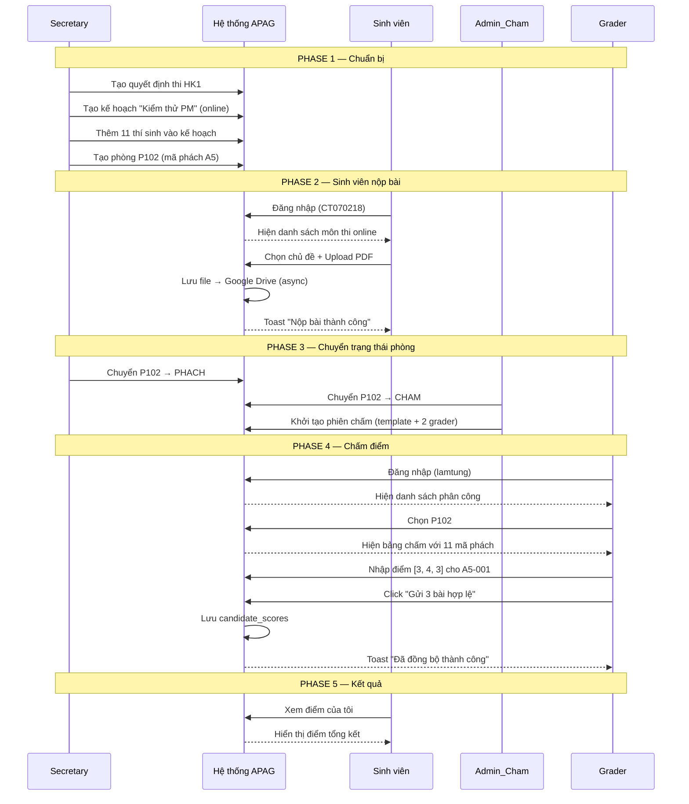

### 5.3. Thứ tự chạy test (CRITICAL)

```bash
# Bước 1: Quản lý kế hoạch thi (độc lập)
npx playwright test exam-schedule-management

# Bước 2: Setup data nộp bài
npx playwright test setup-subject-submission-data

# Bước 3: Test nộp bài
npx playwright test subject-submission

# Bước 4: Setup data chấm điểm (chậm, ~5–8 phút)
npx playwright test setup-grader-mock-data

# Bước 5: Test chấm điểm (global-setup tự chạy)
npx playwright test grader-scoring
```

> **Lưu ý quan trọng:** Bước 4 PHẢI chạy TRƯỚC Bước 5. Grader chỉ thấy phân công sau khi admin đã giao phòng + template, và phòng đó phải ở trạng thái `CHAM` (đi qua đủ chuỗi `THI → PHACH → CHAM`).

### 5.4. Rollback / Cleanup

Khi cần chạy lại Flow 3 từ đầu:

```bash
npx playwright test setup-grader-mock-data --grep "CLEANUP"
```

→ Xóa kế hoạch `Kiểm thử phần mềm` (kéo theo phòng + thí sinh + phiên chấm bị xóa cascade).

---

## 6. SINH KỊCH BẢN KIỂM THỬ

### 6.1. Module 1 – Quản lý Kế hoạch thi (16 TC)

#### Happy cases

| TC | Mô tả | Loại | Phụ thuộc |
|----|-------|------|-----------|
| **TC-ESM-00** | Login Secretary, lưu storageState | Setup | – |
| **TC-ESM-01** | Hiển thị trang ban đầu: title, buttons, filter, empty state | Happy | 00 |
| **TC-ESM-02** | Tìm kiếm theo quyết định `HK1`, verify header bảng | Happy | 00 |
| **TC-ESM-03** | Tạo mới kế hoạch (modal 2 bước: chọn QĐ → điền form → submit) | Happy | 00 |
| **TC-ESM-05** | Sửa `subjectName` + `note` → verify record đổi tên | Happy | 03 |
| **TC-ESM-06** | Xóa thật: inline confirm → custom dialog → "Xóa ngay" → record biến mất | Happy | 05 |
| **TC-ESM-10** | Điền đủ + đúng format → submit enabled | Happy | – |

#### Negative cases

| TC | Mô tả | Loại | Expected |
|----|-------|------|----------|
| **TC-ESM-04** | Mở dialog xóa → click **Hủy** → record VẪN CÒN | Negative | Record không bị xóa |
| **TC-ESM-07** | Bỏ trống `subjectName` → submit disabled | Negative | Button disabled |
| **TC-ESM-08** | Bỏ trống `clazz` → submit disabled | Negative | Button disabled |
| **TC-ESM-09** | Nhập `"ngày 01 tháng 12 năm 2025"` → `.f-err` hiện | Negative | Error chứa "dd/mm/yyyy HH:mm" |
| **TC-ESM-15** | `endDate < startDate` → `.f-err` "Ngày kết thúc phải sau ngày bắt đầu" | Negative | Submit disabled |

#### Edge / Boundary cases

| TC | Mô tả | Loại | Expected |
|----|-------|------|----------|
| **TC-ESM-13** | Input chỉ có ngày (thiếu giờ) → auto fill `07:00` | Edge | initTime có 07:00 |
| **TC-ESM-14** | Input dùng `"->"` + thiếu năm → auto thêm năm hiện tại | Edge | Format chuẩn có "đến" |

#### UI / Integration cases

| TC | Mô tả | Loại |
|----|-------|------|
| **TC-ESM-11** | Mở panel chọn cột, toggle "Ẩn tất cả" / "Hiện tất cả" / "Mặc định" | UI |
| **TC-ESM-12** | Phân trang: đổi `5/trang`, next/prev page, verify nội dung khác | UI |

---

### 6.2. Module 2 – Nộp bài tập lớn (15 TC)

#### Happy cases

| TC | Mô tả | File mock |
|----|-------|-----------|
| **TC-SS-01** | Login sinh viên `CT070218` | – |
| **TC-SS-02** | Hiển thị danh sách môn thi (`.ss-table`) | – |
| **TC-SS-03** | Xem chi tiết môn (modal `.ss-modal--xl`) | – |
| **TC-SS-04** | Mở form nộp bài, verify dropdown 10 chủ đề + dropzone | – |
| **TC-SS-08** | Upload `valid.pdf` → "Sẵn sàng nộp", submit enabled | `valid.pdf` |
| **TC-SS-09** | Thay đổi file + xóa file | `valid.pdf`, `change.pdf` |
| **TC-SS-11** | Nộp đầy đủ (chủ đề + file + description) → toast success | `valid.pdf` |
| **TC-SS-12** | Vào history, xóa bài vừa nộp | – |
| **TC-SS-13** | Verify trạng thái môn quay về "Chưa nộp" | – |

#### Negative cases

| TC | Mô tả | File mock | Expected |
|----|-------|-----------|----------|
| **TC-SS-05** | Chưa chọn file → submit disabled | – | Button disabled |
| **TC-SS-06** | Upload `Invalid.xlsx` → toast warn chứa "PDF" | `Invalid.xlsx` | Toast warn |
| **TC-SS-07** | Upload `> 20 MB` → toast warn chứa "20MB" | `greater-20-mb.pdf` | Toast warn |
| **TC-SS-10** | Có file nhưng KHÔNG chọn chủ đề → toast + error text | `valid.pdf` | "Vui lòng chọn chủ đề" |

#### UI / Cleanup cases

| TC | Mô tả |
|----|-------|
| **TC-SS-14** | Mở dialog hỗ trợ "Liên hệ hỗ trợ" và đóng |
| **TC-SS-15** | Logout qua UI, redirect `/login` |

---

### 6.3. Module 3 – Chấm điểm (17 TC)

#### Happy cases

| TC | Mô tả |
|----|-------|
| **TC-GS-01** | Verify đã login (storageState), không bị redirect về `/login` |
| **TC-GS-02** | Hiển thị header, type-switch ĐH/ThS, danh sách phân công, placeholder |
| **TC-GS-03** | Chọn phòng P102 (filter theo tên + môn + role CB1) |
| **TC-GS-04** | Bảng có 3 cột điểm động + Tổng / Trạng thái / Ghi chú |
| **TC-GS-05** | Nhập điểm hợp lệ 1 hàng → save → toast success → row-saved |
| **TC-GS-10** | Nhập 3 hàng → "Gửi X bài hợp lệ" → draft banner ẩn, toast |
| **TC-GS-11** | Tải file mẫu Excel (download event, filename match `Mau-cham-diem*.xlsx`) |
| **TC-GS-13** | Import `VALID.xlsx` → preview → click "Nhập" → toast success |
| **TC-GS-14** | Xem lịch sử chấm điểm (panel + bảng + row-saved) |
| **TC-GS-15** | Lọc "Chưa xong" / "Xong" / "Tất cả" |

#### Negative cases

| TC | Mô tả | Input | Expected |
|----|-------|-------|----------|
| **TC-GS-06** | Nhập vượt max | `"8"` ở cột max=3 | Tooltip "Tối đa 3", submit disabled |
| **TC-GS-07** | Nhập ký tự không phải số | `"abc"` | Tooltip "Không hợp lệ" |
| **TC-GS-08** | Bỏ trống 1 cột → force click submit | 2 cột điền, 1 trống | "Bắt buộc nhập" |
| **TC-GS-09** | Nhập số âm | `"-1"` | Tooltip "Không hợp lệ" |
| **TC-GS-12** | Import `INVALID.xlsx` | – | `.gs-import-error` hiện, nút "Nhập" disabled |

#### Edge / Cleanup cases

| TC | Mô tả |
|----|-------|
| **TC-GS-16** | Beforeunload khi có dirty data (headless có thể không trigger) |
| **TC-GS-17** | Logout qua UI (`.dg-logout-btn` → `.dg-confirm-box` → redirect `/login`) |

---

### 6.4. Luồng test có phụ thuộc dữ liệu

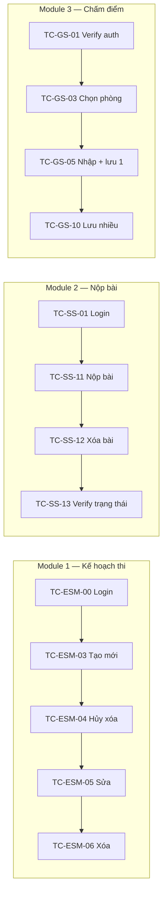

### 6.5. Validation tổng hợp (mapping rule ↔ TC)

| Module | Field | Rule | TC liên quan |
|--------|-------|------|--------------|
| Kế hoạch thi | `subjectName` | required | TC-ESM-07 |
| Kế hoạch thi | `clazz` | required | TC-ESM-08 |
| Kế hoạch thi | `startTimeRaw` | required + pattern `dd/mm/yyyy HH:mm` | TC-ESM-09 |
| Kế hoạch thi | `startTimeRaw` | endDate > startDate | TC-ESM-15 |
| Kế hoạch thi | `stopTime` (datepicker) | `[minDate]="initTime"` | (đảm bảo bởi TC-15) |
| Kế hoạch thi | `startTimeRaw` | auto fill `07:00` khi thiếu giờ | TC-ESM-13 |
| Kế hoạch thi | `startTimeRaw` | hỗ trợ `->`, `tới`, `đến`, thiếu năm | TC-ESM-14 |
| Nộp bài | `topic` | required | TC-SS-10 |
| Nộp bài | `file` | required | TC-SS-05 |
| Nộp bài | `file` | type = `application/pdf` | TC-SS-06 |
| Nộp bài | `file` | size ≤ 20 MB | TC-SS-07 |
| Chấm điểm | mỗi ô score | not-empty | TC-GS-08 |
| Chấm điểm | mỗi ô score | numeric | TC-GS-07 |
| Chấm điểm | mỗi ô score | ≥ 0 | TC-GS-09 |
| Chấm điểm | mỗi ô score | ≤ max cột | TC-GS-06 |
| Chấm điểm | toàn bảng | mọi ô đều hợp lệ → mới enable submit | TC-GS-06..09 |

---

## TỔNG KẾT SỐ LIỆU

| Hạng mục | Số lượng |
|----------|---------:|
| Spec test chính | 3 |
| Spec setup mock | 2 |
| Helper file | 2 (`auth.helper.ts`, `search-select.helper.ts`) |
| Global setup | 1 (`global-setup.ts`) |
| File cấu hình Playwright | 1 (`playwright.config.ts`) |
| File mock PDF | 3 (`valid.pdf`, `greater-20-mb.pdf`, `change.pdf`) |
| File mock Excel | 3 (`Invalid.xlsx`, `VALID.xlsx`, `INVALID.xlsx`) |
| Tài khoản test | 5 (`root`, `ADMIN_CHAM`, `CT070218`, `lamtung`, `huytq`) |
| TC Module 1 (Kế hoạch thi) | 16 |
| TC Module 2 (Nộp bài) | 15 |
| TC Module 3 (Chấm điểm) | 17 |
| TC Setup grader | 8 + 1 CLEANUP |
| TC Setup submission | 3 |
| **Tổng test case** | **60** |

| Phân loại TC | Số lượng |
|--------------|---------:|
| Happy path | ~25 |
| Negative | ~15 |
| Edge / Boundary | ~8 |
| UI / Integration | ~7 |
| Setup / Cleanup | ~5 |

---

> **Kết thúc tài liệu.** File này đủ chi tiết để:
> - Viết test plan E2E đầy đủ.
> - Sinh test case QA tự động.
> - Làm báo cáo DOCX chuyên nghiệp (qua NotebookLM).
> - Handover cho team QA mới.
